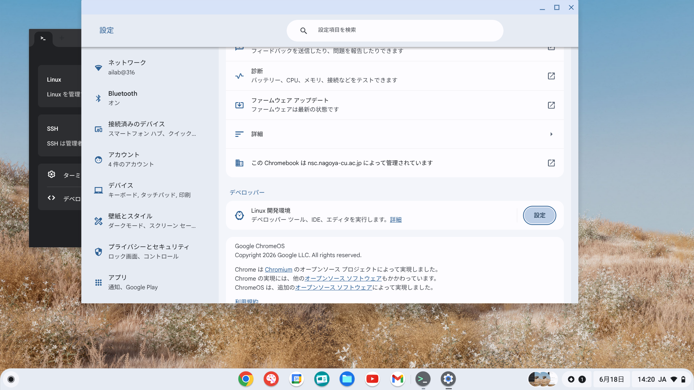
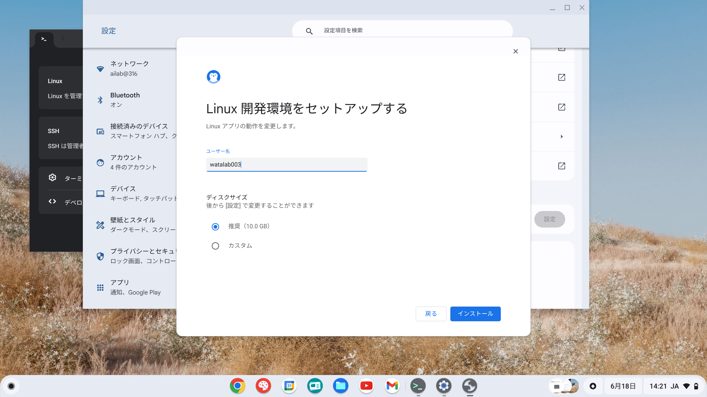
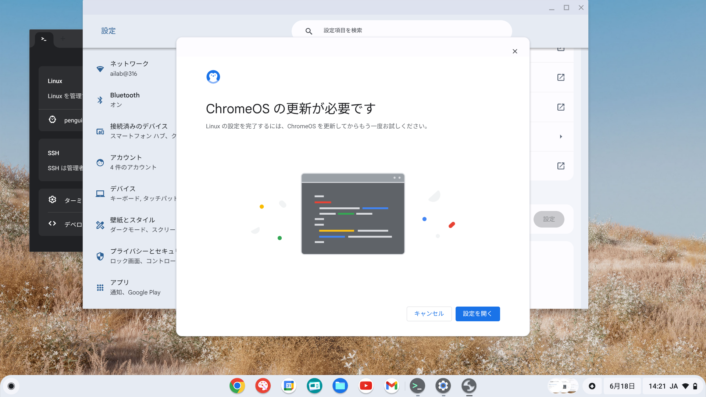
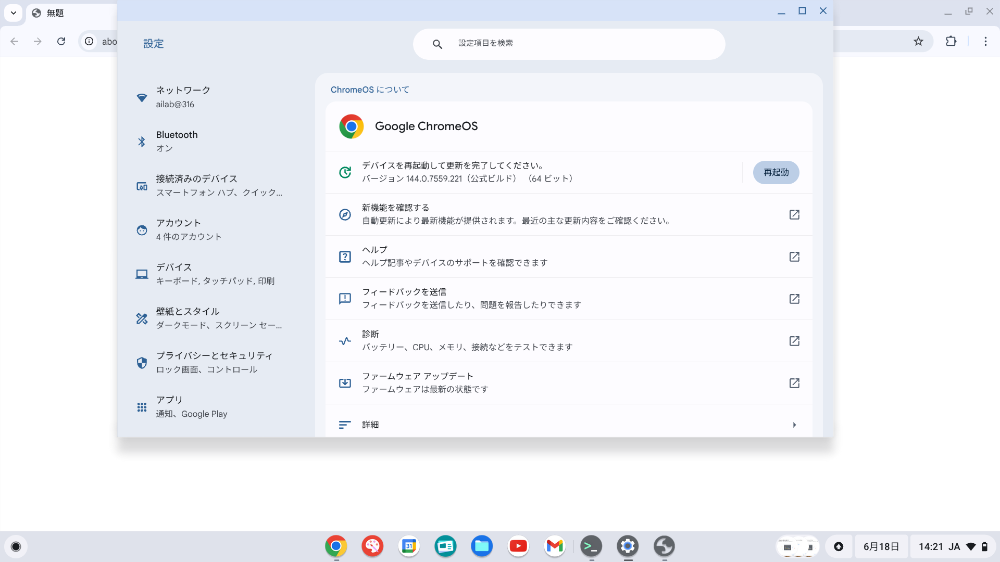
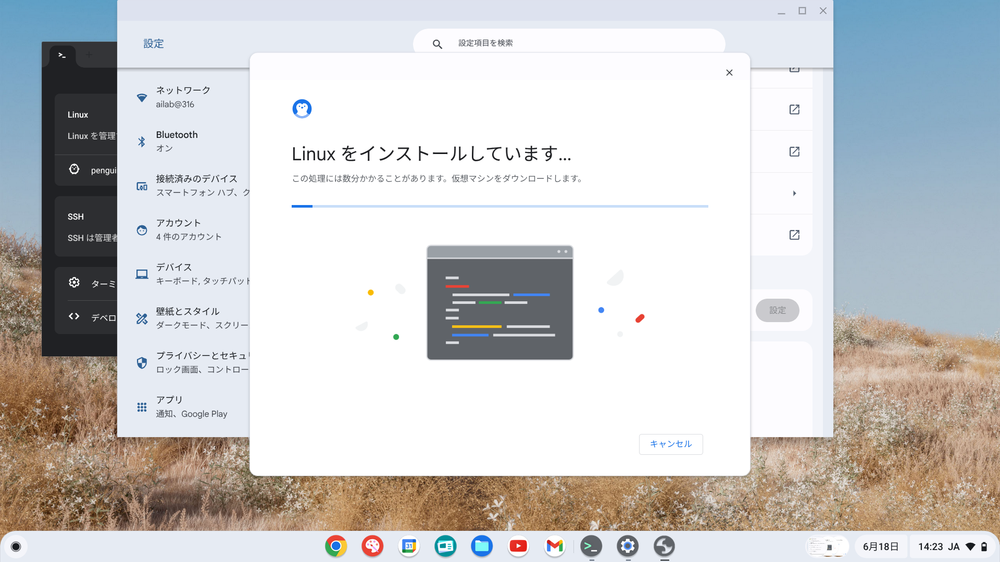
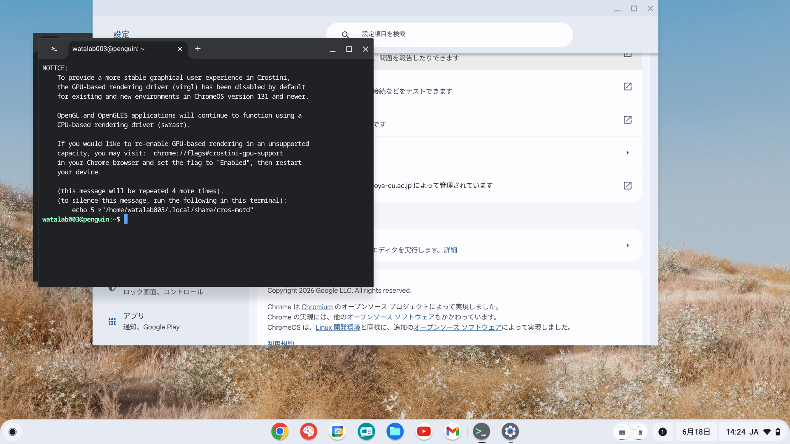

# 💻 基礎知識 09：Chromebook で Linux 開発環境をセットアップしよう！

Chromebook（クロームブック）を使って自動運転戦車を開発するために、まずは Chromebook の中に「Linux（リナックス）」という開発環境を作ってみましょう！

これを入れることで、戦車のプログラムを書き換えたり、戦車に司令を出したりするのに必要な「ターミナル（コマンド画面）」が使えるようになります。

中学生のキミでも、ステップに沿って進めれば簡単にできるよ！

---

## 🛠️ STEP 1：Linux 開発環境を有効にしよう

1. Chromebook の画面右下にある時計をクリックして、**歯車アイコン（設定）** を開きます。
2. 左メニューにある **「デベロッパー」** をクリックします。
3. **「Linux 開発環境」** の項目にある **「オンにする」** または **「インストール」** ボタンをクリックします。

4. セットアップ画面が表示されたら、**「次へ」** をクリックします。

5. **ユーザー名** と **ディスクサイズ** を設定します。
   - **ユーザー名**：アルファベットで自分の名前などを入力します（例: `pi` や `watalabo`）。
   - **ディスクサイズ**：推奨の **10.0 GB** のままで大丈夫です。
   - 設定できたら **「インストール」** をクリックします。

---

## ⚠️ もし「ChromeOS の更新が必要です」と表示されたら？

インストール中に以下のようなエラー画面が出ることがあります。その場合は落ち着いて Chromebook の OS をアップデートしましょう。

1. エラー画面の **「設定を開く」** をクリックします。
2. 設定画面の **「ChromeOS について」** を開き、**「再起動」** ボタンを押してアップデートを完了させます。

再起動後、もう一度 STEP 1 を実行してください。

---

## ⏳ STEP 2：インストール完了を待とう

インストールが始まると、必要なファイルのダウンロードとセットアップが行われます。これには数分かかるので、お茶でも飲みながら待ちましょう！

---

## 🐚 STEP 3：ターミナルの起動を確認しよう

インストールが完了すると、自動的に「ターミナル（黒い画面）」が起動します。以下のように文字が表示されていれば、Linux 開発環境のセットアップは無事完了です！

---

**💡 まとめ：**
これで Chromebook の中に、プロのエンジニアも使う Linux 開発環境ができあがりました！
次は、戦車の頭脳である Raspberry Pi に接続してみましょう！